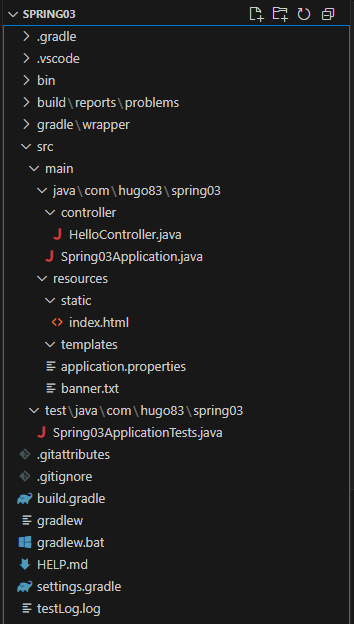

# java-Springboot-2025_
2025년 부경대 java개발자 과정 SpringBoot 리포지토리

## 1일차(04-01)

## 웹 개요
   - 구성 3단계
   - 브라우저(클라이언트/프론트엔드) - 사용자가 **요청**을 하고, 결과를 돌려받는 파트
   - 서버(백엔드) - 사용자의 요청을 받아서 DB에서 데이터를 가져와 처리하고, 사용자에게 **응답**하는 파트
   - 데이터베이스 - 가장 중요한 데이터가 저장되어 있는 파트

## Spring Boot 개요
  - Java - 컴퓨팅 세상 모든곳에서 사용될 수 있는 언어가 되고자 개발됨
    - 웹개발
        1. CGI(Common GateWay Interface) - HTTP 프로토콜에서 정적인 데이터만 전달할 수 있는 웹기술
        2. Servlet - CGI를 개선한 Java 웹기술
        3. EJB(Enterprise Java Bean) - 서블릿으로 대형 프로젝트 개발할 수 있는 JAVA 웹기술
        -HTML 코드를 전부 Java에서 작성 해야함
        4. JSP(Java Server Page) - 웹페이지코드(HTML)에 자바소스를 포함시켜서 개발할 수 있는 
        Java 웹 기술
            - 확장자가 .jsp / 스파게티코드
        5. Spring - Java 웹 개발에 전성기. 웹페이지와 자바영역 분리
            - 설정이 복잡
        6. Spring Boot - Spring의 단점을 최소화. 설정을 간결화
    
    - Spring Boot
        - https://spring.io/projects/spring-boot
        - Spring 기술을 그대로 사용(마이그레이션이 간단)
        - JPA 기술을 사용하면 ERD나 DB설계를 하지 않고도 손쉽게 DB를 생성. DB연동도 쉬움
        - Tomcat Webserver가 내장!(설치 필요없음)
        - 서포트하는 기능 다수 존재(개발을 쉽게 도와줌)
        - 테스트용 JUnit, 로그용 Log4J2 모두 포함(설치 필요없음)
        - 프론트엔드를 다양하게 지원. JSP, **Thymeleaf**, Mustache 등
        - React 등의 자바스크립트 프론트엔드와 연계해서 풀스택 개발 가능
        - MVC(Model View Controller)로 영역을 분리. 각 부분별로 따로 개발

    - MVC
        - View는 JSP포함, Thymeleaf, Mustach, HTML 등등


### Spring Boot 개발환경 설정
- Java
    - Java Runtime과 JDK(Java Developer Kit) 존재   
        - Oracle 외에도 OpenJDK가 산재
        - https://www.azul.com/downloads/?package=jdk#zulu
        - https://adoptium.net/
        - https://jdk.java.net/

    - Java 17버전 이상 설치
        - https://www.oracle.com/kr/java/technologies/downloads/
        - jdk-17.0.13_windows-x64_bin.msi 다운로드

    - 시스템정보(sysdm.cpl) > 고급 > 환경변수 PATH 설정
    - 새로 만들기
        - JAVA_HOME - 본인경로 입력
    - path에 %JAVA_HOME%\bin 추가, 맨 위로

  - powershell
        - java --version

- Visual studio Code 확장 설치
    - Java 검색
        - Extension Park for Java 설치. Debugger for Java등 총 7가지 확장 설치

### Spring Boot 설정
- Visual Studio Code 확장 설치
    - Spring 검색
        - Spring Boot Extension Pack 설치(추가 3개 확장 같이 설치됨)
    - Gradle(빌드툴) 검색
        - Gradle for Java 설치

### Spring Boot 기본 실행(Java 프로젝트)
- VS Code에서 명령팔레트 실행
    - Spring Initializr: Create a Maven Project
    - Specify Spring Boot version: 3.3.10
    - Specify project language: Java
    - Input Group Id: com.hugo83(각자 설정할 것)
    - Input Artifact Id: spring01
    - Specify packaging type: Jar(Java archive, 압축파일)
    - Specify Java version: 17
    - Choose dependencies: Selected 0 dependencies
    - 저장위치 선택
    - **새 창 열기** – Spring Boot 프로젝트가 루트폴더가 된 개발환경

- 실행방법
    - 코드 작성
    - Spring Boot Dashboard > Apps > 앱 또는 Ctrl+F5

- 기초문법 
    - [JAVA기초문법](./JAVA_BASIC.md)
    - 기본, 변수, 자료형, 연산자, 흐름제어,

## 2일차
- 기초문법 계속 
    - [JAVA기초문법](./JAVA_BASIC.md)
    - 흐름제어(반복문), 배열, 메서드, 객체/클래스, 상속

## 3일차
- 기초문법 계속 
    - [JAVA기초문법](./JAVA_BASIC.md)
    - 상속, 인터페이스, 예외처리, 제네릭, 컬렉션 프레임워크, 입출력

### Spring Boot Build Tool
- 개요
    - 프로젝트 빌드 과정을 자동화시켜주는 도구
    - 컴파일, 테스트, 패키징, 의존성 관리, 배포 등등 포함 

- Maven
    1. Java 프로젝트 기본 빌드도구
    2. Maven Repository, https://mvnrepository.com/ 검색가능
    3. 빌드, 패키징(jar/war파일 생성), 테스트 등을 한번의 명령으로 간편하게 처리
    4. 가장 큰 특징이 외부 라이브러리 자동으로 다운로드, 관리
    5. pom.xml(Project Object Model) 파일로 빌드 설정 관리
        - 초기 설정시 빠졋거나, 추가되어야 하면 xml 코딩으로 추가
    6. VS Code 확장 중 Maven Dependency Explorer 등으로 확인

- Gradle
    1. 안드로이드용 오픈소스 빌드도구
    2. Maven Repository를 같이 사용
    3. Maven 3, 4번 특징을 그대로 가지고 있음
    4. build.gradle 파일 사용. Groovy 스크립트 지원
    5. 빌드과정을 병렬처리, 캐싱 사용으로 Maven보다 10~100배 향상된 성능 구현


## 4일차
- 기초문법 마무리
- Spring Boot 시작


## 5일차

### 스프링부트 배너(중요도 없음)
- resources 폴터에 banner.txt 생성
- 내용 추가
- [Spring Boot Banner Generator](https://devops.datenkollektiv.de/banner.txt/index.html)
- 배네제너레이터로 생성한 글자 복사 배너 txt에 붙여넣기
- 서버 재시작

### 메인페이지 추가
- resources/static/index.html 부터 시작

### 스트링부트 프로젝트 구조


- 각 폴더 구조
    - gradle~ build : 그레이들, VSCode, 빌드 등 에 필요한 폴더
    - **src/main/java** : 패키지와 자바 소스가 저장되는 위치
    - com.qwak.spring03 : 패키지. 폴더로 구성
        - HelloController 클래스에 접근하려면
        - com.qwak.spring03.controller.HelloController 접근해야 함
        - Spring03Application.java: 시작프로그램
        - src/main/resources : 자바파일 이외 HTML, CSS, JS, 환경파일 등 리소스 파일들이 저장되는 위치
            - **static** : CSS, JS, 이미지 파일 저장되는 곳
            - **templates** : 스프링부트와 연계되는 HTML 파일이 저장되는 곳
            - **application.propertoes** : 프로젝트 환경 설정. 환경변수, DB설정
        - src/test/java : JUnit 스프링부트 테스트도구 자바
        - **build.gradle** : 그레이들 환경 파일. Groovy 기반으로 한 빌드도구. dependencies 만 잘 구성하면 됨 (필요한 것 있으면 모듈 추가)
        - gradle.bat : 중간에 직접 그레이들 빌드를 할 때 사용하는 배치 파일.
        - settings.gradle : 고급 그레이들 설정. 손댈일 없음

### 스프링부트 어노테이션

#### @SpringBootApplication
- 스프링부트 자동구성 매커니즘 활성화
- 어플레케이션 내 패키지에서 컴포넌트들 스캐닝
- 설정 크래스 임포트해서 활성화, 스프링부트 실행

#### @Controller
- 컴포넌트 구체화해서 해당클래스 IoC 컨테이너 Bean으로 등록

#### @GetMapping
- Get, Post 중 Get(URL)로 들어오는 주소를 매핑. 처리해주는 역할
- @PostMapping, @RequestMapping 등 파악

#### @ResponseBody
- HTTP 요청의 자바 객체가 처리한 body 내용을 매핑하는 역할
- 자바의 String 문자열을 웹페이지에 렌더링

## 6일차(06-30)
- Spring Boot JPA + Oracle + Thymeleaf + React
    - JPA - DB설계 없이 엔티티 클래스 만으로 테이블 자동 생성해 주는 기술. SQL 필요 X
        - JPA 이전 - MyBatis. SQL + XML 로 구성된 ORM 기술
    - H2 - Oracle, MySQL 등과 달리 인메모리DB. Spring Boot에서 자동으로 실행해주는 DB
        - 개발할 때 사용. 운영시 이전 할 때 DB 종류에 관계 없이 이전이 가능. 개발동안 사용
    - Thymeleaf - JSP 단점으 보완한 템플릿 형태 FE 개발방식
    - 소셜 로그인 - 구글, 카카오, 네이버 SSO 로그인 연동(OAuth.2.0)
    - React - FE를 완전 분리

- Spring Boot 프로젝트 생성

    1. 명령 팔레트로 시작(Ctrl + Shift + P) :Spring Initializr: Create a Gradle(Maven) Project
    2. Spring Boot version : 3.5.3
    3. Project language : Java 
    4. Group ID: com.pknu
    5. Aritifact Id: backboard
    6. Specify packaging type: Jar
    7. Java Version: 17
    8. Dependency
        - Spring boot DevTools : 개발시 필요한 명령어, 기능 포함
        - Lombok : 어노테이션 등 편리하게 해주는 플러그인 라이브러리
        - Spring Web : 프론트엔드(html) 개발을 할 때 필요한 의존성
        - Thymeleaf: html + Spring Boot 태그 매핑을 편하게 해주는 기능
        - H2 Database(later): 개발동안 필요한 인메모리DB
        - Oralcle Driver(later): 실제 운영할 DB
        - Spring Data JPA(later): DB 생성 + ORM

    9. 저장위치 지정, Generate into this forder 선택
    10. 오플쪽 하단 프로젝트폴더 Open 버튼 클릭
    
- Spring Boot BackBoard Project 

    - Gradle plugin - Dependency 파익 프로젝트 업데이트
    - Spring Boot dashboard - 프로젝트 실행

- Spring Boot 설정 파일
    - build.gradle - 그레이들에서 서정할 구성 내용
    - application.properties - Spring Boot 프로젝트 자체 설정 파일
    - settings.gradle gradle-wrapper.properties - 손댈일 없음

### 스프링부트 Backboard 프로젝트

    1. resources/appication.properties
        
        ```properties
        server.port = 9097 # 포트변경
        spring.output.ansi.enabled=always # 로그 색상 설정

        logging.level.root=info # 로그 출력 레벨 설정
        logging.file.name=C:/temp/backboard.log #로그파일 위치
        ```

    2. build.gradle, Dependency

        ```gradle
        dependencies {
        //기본 의존성

        // 테스트용 의존성
        testImplementation 'org.springframework.boot:spring-boot-starter-test'
        testRuntimeOnly   'org.junit.platform:junit-platform-launcher'

        // DB 연동용 의존성
        runtimeOnly       'com.h2database:h2'              // 개발시에만 사용하는 InMemoryDB H2
        implementation    'org.springframework.boot:spring-boot-starter-data-jpa'
        }
        ```

    3. Controller 작업
        
        - MainController 생성
        - 새 파일로 생성 or Menu Java New file > class 둘 다 동일

    4. /resources/templates/ 에 Mapping 메서드 리턴값과 동일한 html을 작성


2. DB연동
    1. H2 DB 의존성 추가
    2. application.properties에 H2 관련 설정 추가
        ```properties

    
    3. http://localhost:9097/h2-console 접속

    

    4. application.properties에 JPA 설정

        ```properties
        spring.jpa.properties.hibernate.dialect=org.hibernate.dialect.H2Dialect
        spring.jpa.hibernate.ddl-auto=update
        ```

        - JPA 등의 ORM 작업시 사용하는 기술 - 하이버네이트
        - spring.jpa.hibernate.ddl-auto 종류
                - create : SB 서버 시작 시 테이블을 모두 삭제 후 재생성(데이터 모두 휘발)
                - create-drop : create와 동일. 서버가 종류되면 테이블 모두 삭제
                - update : 엔티티 변경부부만 적용. 원래 있던 데이터는 존재
                - validation : 엔티티와 테이블간 차이점 검사만
                - truncate: 데이터를 모두 날림
                - none : 엔티티가 변경되어도 DB는 변경하지 않음


    5. MVC 패턴에 맞춰 각 기능별로 패키지(폴더) 생성
        1. controller, entity, service...
        2. entity
            1. 테이블로 생성할 Board 클래스 생성
            2. Lombok @Getter/@Setter를 사용하면 Get, Set~ 메서드 작성 필요 x

    6. @(Annotation) 정리
        - Lombok
            - @Getter : getter 메서드 자동 생성
            - @Setter : setter 메서드 자동 생성
        - JPA
            - @Entity : 테이블화 할 객체 선언
            - @Id : 테이블 PK
            - @GeneratedValue(strategy = GenerationType.AUTO)
                - AUTO : MySQL Auto Increment
                - IDENTITY : SQLServer Identity(1,1)
                - SEQUENCE: Oracle Sequence 
                - H2 DB를 오라클 타입으로 썻다가, 나중에 운영 DB를 오라클로 갈아 타겠다!
            - @Column : 컬럼의 속성을 변경 (ex: @Column(name="subject",length = 250))
                - name : DB상의 실제 컬럼명을 엔티티와 다르게 사용할 때
                - length : 길이를 지정
                - updateable : 최초 작성이후 수정여부. false는 수정 불가
        - SpringFramework
            - @CreatedDate : 생성일
            - @LastModifiedDate : 최종수정일 에 대한 어노테이션

    7. entity 패키지(폴더) 작성
        1. 테이블로 생성할 Board 클래스 생성
        2. Lombok @Getter/@Setter를 사용하면 Get~ Set~ 사용 가능

    8. repository 패키지(폴더) 작성
        1. DB상의 데이터를 CRUD 할 수 있게 도와주는 인터페이스
        2. SELECT -> findAll(), INSERT -> save() 메서드 기본 제공
        3. BoardRepository 인터페이스 생성

3. 단위 테스트  
   1. build.gradle에 JUnit 의존성 추가  
      ```gradle
      // JUnit 단위테스트
      testImplementation 'org.junit.jupiter:junit-jupiter'
      ```  
   2. INSERT 단위테스트  
   3. `test/.../backboard/BackboardApplicationTests.java`에 단위테스트 메서드 작성  
    

   4. SELECT, SELECT … WHERE 단위테스트  

   5. 디버그 콘솔에서 쿼리 로그로 확인. `application.properties` 설정 추가  

    ```properties
    #테스트 시 쿼리 확인
    spring.jpa.properties.hibernate.format_sql=true
    spring.jpa.properties.hibernate.show_sql=true
    ```
## 7일차(07-01)
